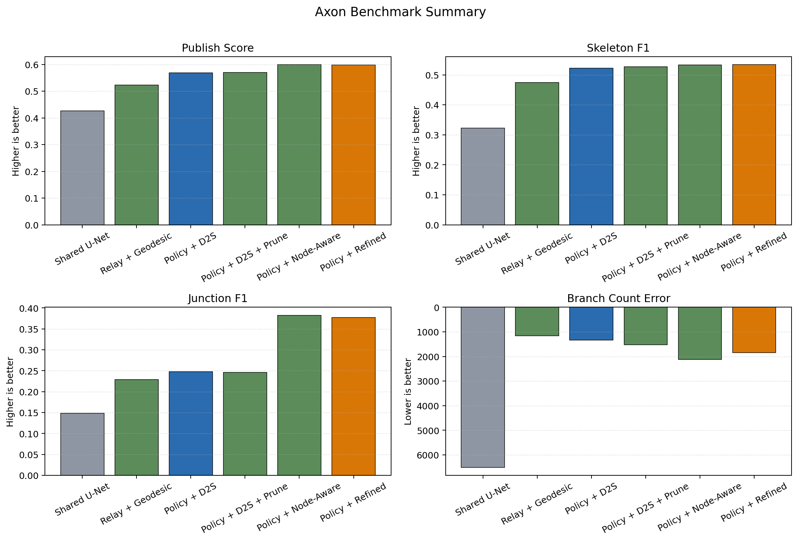
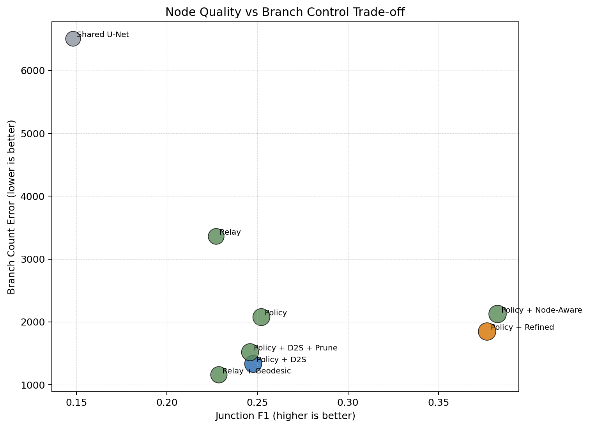
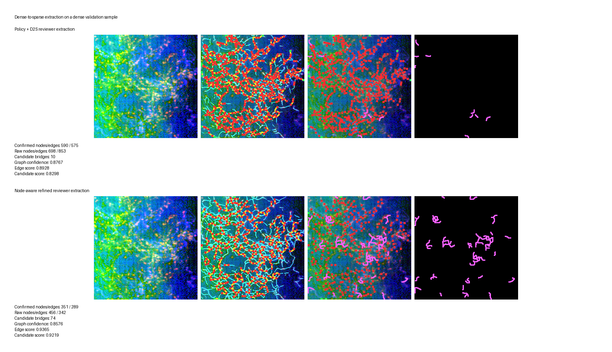

# Methodology and Experimental Section

## 3. Method

### 3.1 Problem Definition

We study **topology-aware dense-to-sparse extraction**: given a dense neuronal image representation
\[
\mathbf{x}\in\mathbb{R}^{C\times H\times W},
\]
we seek a compact structural description that preserves the main neuronal backbone while discarding redundant local thickness and weak side branches. The model predicts
\[
\{\mathbf{M},\mathbf{S},\mathbf{J},\mathbf{E},\mathbf{D},\mathbf{A},\mathbf{U}\},
\]
where \(\mathbf{M}\) is the dense mask, \(\mathbf{S}\) the sparse skeleton, \(\mathbf{J}\) and \(\mathbf{E}\) the junction and endpoint heatmaps, \(\mathbf{D}\) the node-degree map, \(\mathbf{A}\) the affinity field, and \(\mathbf{U}\) the uncertainty map. These maps are then decoded into a **confirmed sparse graph** and a separate set of **candidate bridges** for downstream mapping.

The current flagship model keeps one coherent mechanism throughout the paper: a shared backbone followed by a **unified causal policy** that converts dense evidence into sparse structure under explicit topology, node-capacity, and branch-pruning constraints.

### 3.2 Architecture Overview

The full architecture is implemented in [toposparsenet.py](/Users/lenguyenlinhdan/Desktop/SparseGraph/sparse_graph/models/toposparsenet.py), with the main reasoning modules in [blocks.py](/Users/lenguyenlinhdan/Desktop/SparseGraph/sparse_graph/models/blocks.py). Given the input \(\mathbf{x}\), a high-resolution U-Net backbone first produces a shared feature tensor
\[
\mathbf{F} = \mathcal{B}_\theta(\mathbf{x}).
\]
We then form dense and sparse streams
\[
\mathbf{F}^{d}=\phi_d(\mathbf{F}),\qquad \mathbf{F}^{s}=\phi_s(\mathbf{F}),
\]
where \(\phi_d\) and \(\phi_s\) are residual stems. From these features, the network predicts coarse topology maps \((\mathbf{M}^{c},\mathbf{S}^{c},\mathbf{J}^{c},\mathbf{E}^{c})\), refines both streams with topology-aware gating, and couples them through dense-sparse routing.

The model then applies three progressively more structured reasoning stages:

1. **Branch relay reasoning** to propagate branch evidence across scales and to estimate bridge support.
2. **Counterfactual geodesic reasoning** to model whether a connection remains valid when part of the current centerline evidence is dropped.
3. **Unified causal policy** to decide which structures should be kept as essential sparse backbone and which should be suppressed as redundant local branching.

This design matters because our goal is not simply to segment foreground pixels, but to transform dense morphology into a sparse graph that is easier to analyze downstream.

### 3.3 Relay-Geodesic Topology Reasoning

The first novel stage is the relay-geodesic topology block, built from [BranchRelayReasoning](/Users/lenguyenlinhdan/Desktop/SparseGraph/sparse_graph/models/blocks.py#L239) and [CounterfactualGeodesicReasoning](/Users/lenguyenlinhdan/Desktop/SparseGraph/sparse_graph/models/blocks.py#L475). It takes the current topology predictions and constructs relay features that favor long, topology-consistent paths rather than isolated local responses.

Let
\[
\mathbf{T}^c = [\sigma(\mathbf{M}^{c}),\sigma(\mathbf{S}^{c}),\sigma(\mathbf{J}^{c}),\sigma(\mathbf{E}^{c})]
\]
be the coarse topology state. Relay reasoning produces bridge and path-memory logits
\[
\{\mathbf{B},\mathbf{B}^{cf},\mathbf{P},\mathbf{G}^{cf}\}
  = \mathcal{R}(\mathbf{F}^{d},\mathbf{F}^{s},\mathbf{T}^c),
\]
where \(\mathbf{B}\) is the bridge prior, \(\mathbf{B}^{cf}\) the counterfactual bridge prior, \(\mathbf{P}\) the path-memory map, and \(\mathbf{G}^{cf}\) a counterfactual gate.

Intuitively, this stage asks two questions:

- Which paths remain structurally plausible after aggregating relay evidence?
- Which paths are still plausible when part of the current evidence is removed?

That second question is important for dense-to-sparse extraction because it makes the model less dependent on thick local support alone and more sensitive to path continuity.

### 3.4 Unified Causal Policy for Dense-to-Sparse Projection

Our main proposed mechanism is the **unified policy line**, implemented by [NodeAwareCausalPolicy](/Users/lenguyenlinhdan/Desktop/SparseGraph/sparse_graph/models/blocks.py#L613) and [CausalBranchAusterity](/Users/lenguyenlinhdan/Desktop/SparseGraph/sparse_graph/models/blocks.py#L741). Rather than stacking unrelated novelty blocks, this policy consolidates node awareness, path importance, dense-to-sparse projection, and branch keep/prune reasoning into one consistent sparse-selection stage.

Given the policy input state
\[
\mathbf{T}^p = [\sigma(\mathbf{M}^{r}),\sigma(\mathbf{S}^{r}),\sigma(\mathbf{J}^{r}),\sigma(\mathbf{E}^{r}),\sigma(\mathbf{R}),\sigma(\mathbf{B}),\sigma(\mathbf{B}^{cf}),\sigma(\mathbf{P})],
\]
the policy predicts:
\[
\{\mathbf{C},\mathbf{Q},\mathbf{P}_{ds},\mathbf{K},\mathbf{R}_{pr}\}
 = \mathcal{P}(\mathbf{F}^{d},\mathbf{F}^{s},\mathbf{T}^p),
\]
where \(\mathbf{C}\) is node capacity, \(\mathbf{Q}\) is causal saliency, \(\mathbf{P}_{ds}\) is the dense-to-sparse projection prior, \(\mathbf{K}\) is branch-keep evidence, and \(\mathbf{R}_{pr}\) is branch-prune evidence.

The final skeleton logits are formed by fusing the sparse branch prediction with relay and policy outputs:
\[
\mathbf{Z}_S
= h_S(\mathbf{F}^{s})
 + 0.30\,\mathbf{B}
 + 0.20\,\mathbf{B}^{cf}
 + 0.20\,\mathbf{P}
 + 0.10\,\mathbf{G}^{cf}
 + 0.15\,\mathbf{Q}
 + 0.25\,\mathbf{P}_{ds}
 + 0.15\,\mathbf{K}
 - 0.20\,\mathbf{R}_{pr}.
\]
This equation mirrors the implementation in [toposparsenet.py](/Users/lenguyenlinhdan/Desktop/SparseGraph/sparse_graph/models/toposparsenet.py#L321).

The key intuition is simple: the model does not try to make the sparse output purely from local skeleton evidence. Instead, it projects dense evidence into sparse support and then uses explicit keep/prune signals to decide which branches should survive.

### 3.5 Node-Aware Degree Modeling and Conservative Decoding

The next refinement focuses on nodes. Junctions are sparse and error-sensitive, so binary node supervision alone is not enough. We therefore use Gaussian-style node heatmaps and a dedicated node-degree head:
\[
\mathbf{Z}_D = h_D(\mathbf{F}^{s}) + 0.35\,\mathbf{C},
\]
where \(h_D\) is the node-degree head and \(\mathbf{C}\) is the node-capacity map. This is implemented in [toposparsenet.py](/Users/lenguyenlinhdan/Desktop/SparseGraph/sparse_graph/models/toposparsenet.py#L331) and trained in [losses.py](/Users/lenguyenlinhdan/Desktop/SparseGraph/sparse_graph/losses.py#L377).

At inference, [GraphBuilder](/Users/lenguyenlinhdan/Desktop/SparseGraph/sparse_graph/graph/builder.py#L46) extracts nodes from the junction and endpoint heatmaps, refines them with sparse support and degree consistency, and routes paths geodesically through a support-weighted cost map. The structure support used by the path solver is
\[
\mathbf{S}_{sup}
 = \mathrm{clip}\left(
 0.45\,\sigma(\mathbf{Z}_S)
 + \lambda_b\,\sigma(\mathbf{B})
 + \lambda_r\,\sigma(\mathbf{R})
 + 0.20\,\sigma(\mathbf{P}_{ds})
 + \lambda_m\,\sigma(\mathbf{Z}_M)
 + \lambda_c\,\sigma(\mathbf{Q})
 \right),
\]
and the corresponding geodesic cost is
\[
\mathcal{C}(y,x) = -\log \mathbf{S}_{sup}(y,x) + \lambda_u \mathbf{U}(y,x).
\]

For a candidate pair of nodes \(i,j\), we score the decoded path \(p_{ij}\) using both heuristic support and a learned relation probability:
\[
w_{ij} = (1-\lambda_{rel})\,h_{ij} + \lambda_{rel}\,r_{ij},
\]
where \(h_{ij}\) aggregates path support, affinity alignment, and node confidence, while \(r_{ij}\) uses graph embeddings, path memory, causal saliency, uncertainty, and node-degree compatibility. Edges that pass the conservative threshold become part of the **confirmed graph**; edges with strong relation score but insufficient confirmation are exported as **candidate bridges**. This separation is important because it prevents the extractor from hallucinating unsupported neuron-to-neuron connections while still preserving plausible reconnection hypotheses.

### 3.6 Objective Function

The full loss is implemented in [losses.py](/Users/lenguyenlinhdan/Desktop/SparseGraph/sparse_graph/losses.py) and can be summarized as
\[
\mathcal{L}
= \lambda_m \mathcal{L}_{mask}
 + \lambda_s \mathcal{L}_{skel}
 + \lambda_t \mathcal{L}_{topo}
 + \lambda_n \mathcal{L}_{node}
 + \lambda_d \mathcal{L}_{deg}
 + \lambda_r \mathcal{L}_{relay}
 + \lambda_p \mathcal{L}_{policy}
 + \lambda_b \mathcal{L}_{budget}
 + \lambda_a \mathcal{L}_{austerity}
 + \lambda_g \mathcal{L}_{graph}
 + \lambda_{gm} \mathcal{L}_{graph\_minimal}
 + \lambda_c \mathcal{L}_{consistency}
 + \lambda_{aux}\mathcal{L}_{aux}.
\]

The main terms are:

- **Dense mask loss**
  \[
  \mathcal{L}_{mask} = \mathcal{L}_{Dice}(\mathbf{M},\mathbf{M}^{*}) + \mathcal{L}_{Focal}(\mathbf{M},\mathbf{M}^{*}).
  \]
- **Sparse skeleton loss**
  \[
  \mathcal{L}_{skel} = \mathcal{L}_{Dice}(\mathbf{S},\mathbf{S}^{*}) + 0.30\,\mathcal{L}_{Tversky}(\mathbf{S},\mathbf{S}^{*}),
  \]
  which adds precision pressure beyond plain Dice.
- **Topology loss**
  \[
  \mathcal{L}_{topo} = \mathcal{L}_{clDice}(\mathbf{M},\mathbf{M}^{*}),
  \]
  to preserve centerline connectivity.
- **Node loss**
  uses soft heatmap supervision for junctions and endpoints rather than only binary points.
- **Branch budget loss**
  penalizes excess local degree, branch-point overflow, and count mismatch.
- **Branch austerity loss**
  trains the keep/prune heads against backbone and redundant graph paths, and penalizes branch excess away from valid node neighborhoods.
- **Graph loss**
  supervises pairwise node relations and essential path retention.

For checkpoint selection we also report a composite **publish score**, implemented in [metrics.py](/Users/lenguyenlinhdan/Desktop/SparseGraph/sparse_graph/metrics.py#L394):
\[
\text{PS}
= 0.25\,\text{clDice}
 + 0.20\,F1_{mask}
 + 0.20\,F1_{skel}
 + 0.15\,F1_{junc}
 + 0.10\,F1_{end}
 + 0.10\,\max(0,1-\text{component\_error}).
\]
We use it only as a compact model-selection summary; the individual metrics remain the primary evidence.

## 4. Experiments

### 4.1 Dataset, Protocol, and Metrics

We evaluate on the public axon dataset described in the attached paper *A neuronal imaging dataset for deep learning in the reconstruction of single-neuron axons*. The current repo uses the conversion pipeline in [prepare_axon.py](/Users/lenguyenlinhdan/Desktop/SparseGraph/scripts/prepare_axon.py), which turns each 3D TIFF block and SWC tree into:

- a 4-channel 2D input summary: mean, max, std, and argmax-depth projection,
- a dense mask target,
- a sparse skeleton target,
- junction and endpoint targets,
- a 2-channel affinity target,
- an uncertainty target.

Our processed split contains **676 train / 85 val / 91 test** samples in [data/axon_npz](/Users/lenguyenlinhdan/Desktop/SparseGraph/data/axon_npz). All reported experiments use the same local split and metric suite, which makes the comparisons internally fair.

Implementation details follow the actual training configs in this repo. The strongest current model uses `relay_geodesic_policy` with `base_channels=32`, four resolution stages, `graph_embedding_channels=24`, AdamW optimization, batch size `2`, and \(256\times256\) training crops; see [toposparsenet_axon_policy_nodeaware_refined_mps.json](/Users/lenguyenlinhdan/Desktop/SparseGraph/configs/toposparsenet_axon_policy_nodeaware_refined_mps.json). Late-stage variants were trained as warm-started refinement runs from their immediate predecessor, which is useful for module attribution but should still be read as an iterative development benchmark rather than a final large-budget retraining sweep.

We report `mask_f1`, `skeleton_f1`, `clDice`, `junction_f1`, `endpoint_f1`, `graph_accuracy`, `graph_recall`, `component_error`, `branch_count_error`, and `length_error`. Lower is better for the last three.

### 4.2 Direct Comparison with Baselines

Table 1 compares the strict local baseline against the strongest topology-aware variants on the same axon validation split.

| Model | publish_score | mask_f1 | skeleton_f1 | clDice | junction_f1 | endpoint_f1 | component_error | branch_count_error | length_error |
|---|---:|---:|---:|---:|---:|---:|---:|---:|---:|
| Shared U-Net | 0.4259 | 0.7247 | 0.3231 | 0.7759 | 0.1482 | 0.0020 | 44.5882 | 6506.4000 | 4.5690 |
| Relay + Geodesic | 0.5230 | 0.7855 | 0.4743 | 0.8308 | 0.2286 | 0.2902 | 40.6706 | **1160.2941** | 0.6020 |
| Policy + D2S | 0.5685 | 0.8449 | 0.5219 | 0.8888 | 0.2476 | 0.3585 | 23.4471 | 1334.8353 | **0.3036** |
| Policy + D2S + Prune | 0.5702 | 0.8437 | 0.5276 | 0.8879 | 0.2459 | 0.3706 | **21.5765** | 1523.6118 | 0.3307 |
| Policy + Node-Aware | **0.5992** | 0.8546 | 0.5325 | 0.9014 | **0.3826** | **0.3905** | 22.7882 | 2127.2706 | 0.4347 |
| Policy + Refined | 0.5989 | **0.8561** | **0.5337** | **0.9024** | 0.3768 | 0.3883 | 22.9176 | 1851.2471 | 0.3728 |

**Table 1.** Direct internal comparison on the same axon validation split.

Three conclusions are clear. First, every topology-aware variant is much stronger than the strict shared U-Net baseline. Second, the policy line is now clearly the strongest family: relative to the shared U-Net, the refined model improves `skeleton_f1` by about **0.211**, `clDice` by about **0.126**, and `junction_f1` by about **0.229**. Third, there is a real trade-off between **node quality** and **branch austerity**. The node-aware model gives the best node metrics and best composite `publish_score`, while the refined version preserves those gains and partially recovers cleaner branch behavior.

Figure 1 summarizes the same trend visually.

**Figure 1.** Summary of direct benchmark trends. The unified policy line markedly improves sparse extraction quality over the strict shared U-Net baseline; the remaining challenge is balancing node recall against branch over-selection.

### 4.3 Contextual Published References

The direct comparisons above are the fairest evidence because they share the same split and preprocessing. For paper framing, Table 2 lists adjacent public references that are relevant but **not directly comparable** to our current protocol.

| Reference | Dataset | Reported metrics | Why it is not directly comparable |
|---|---|---|---|
| Axon dataset tracing paper | Public single-neuron axon dataset | Precision 0.82, Recall 0.97, F1 0.87 | 3D tracing/tree reconstruction protocol rather than our 2D proxy dense-to-sparse evaluation |
| FISBe / PatchPerPix | FISBe benchmark | avF1 0.29-0.34, clDice_TP 0.80-0.81 | Official instance benchmark with different targets and metrics |
| Topology-aware cascaded U-Net | IXI vessels | DSC 0.83, clDice 0.88 | Relevant topology baseline, but different imaging domain |

**Table 2.** Adjacent published reference bars. These numbers are useful context, but we do not claim direct SOTA comparison yet.

### 4.4 Ablation Study of the Proposed Modules

Table 3 isolates the contribution of each stage in the final policy line. This table is especially important because it focuses the paper on the current mechanism rather than presenting a collection of unrelated “novel modules.”

| ID | Variant | Main change | publish_score | skeleton_f1 | junction_f1 | endpoint_f1 | branch_count_error | length_error |
|---|---|---|---:|---:|---:|---:|---:|---:|
| A0 | Shared U-Net | Baseline segmentation-only shared decoder | 0.4259 | 0.3231 | 0.1482 | 0.0020 | 6506.4000 | 4.5690 |
| A1 | + Relay / Geodesic | Add relay reasoning and geodesic relation decoding | 0.5230 | 0.4743 | 0.2286 | 0.2902 | 1160.2941 | 0.6020 |
| A2 | + Unified Policy | Add causal policy with keep/prune routing | 0.5657 | 0.5197 | 0.2521 | 0.3470 | 2080.3059 | 0.4588 |
| A3 | + Dense-to-Sparse Projection | Inject dense-to-sparse projection prior into final skeleton prediction | 0.5685 | 0.5219 | 0.2476 | 0.3585 | 1334.8353 | **0.3036** |
| A4 | + Prune-Aware Supervision | Train branch keep/prune against redundant graph paths | 0.5702 | 0.5276 | 0.2459 | 0.3706 | 1523.6118 | 0.3307 |
| A5 | + Node Heatmaps / Degree | Use Gaussian node supervision and degree prediction | **0.5992** | 0.5325 | **0.3826** | **0.3905** | 2127.2706 | 0.4347 |
| A6 | + Refined Degree-Aware Austerity | Tighten pruning around low-capacity and endpoint neighborhoods | 0.5989 | **0.5337** | 0.3768 | 0.3883 | 1851.2471 | 0.3728 |

**Table 3.** Ablation of the final policy line.

The ablation reveals the following:

- **Relay / geodesic reasoning** delivers the largest early jump in sparse extraction quality and branch-count control.
- **Unified policy** substantially improves topology and node fidelity, but it initially re-introduces excess branching.
- **Dense-to-sparse projection** is the most important sparsity-oriented addition. It improves sparse quality while sharply reducing branch-count error and path length error.
- **Prune-aware supervision** improves graph recall and stabilizes redundant-path suppression.
- **Node heatmaps / degree modeling** give the largest jump in `junction_f1` and `endpoint_f1`, which confirms that node modeling was the correct direction for the current gap.
- **Refined degree-aware austerity** preserves the node gains while recovering cleaner branch control, making it the strongest current deployment-oriented refinement of the policy line.

Figure 2 shows the same trade-off directly: better junction fidelity currently tends to come with worse branch-count control, which is the main remaining gap.

**Figure 2.** Junction quality versus branch-count error. The current model family is strong, but the remaining challenge is to improve node quality without allowing the confirmed graph to become overly dense.

### 4.5 Output-Graph Analysis on a Dense Validation Example

We next analyze dense-to-sparse behavior on a particularly dense validation sample, [0231-31_18_18-0_0_0.tif.npz](/Users/lenguyenlinhdan/Desktop/SparseGraph/data/axon_npz/val/0231-31_18_18-0_0_0.tif.npz). Table 4 compares the older dense-to-sparse policy extraction against the current node-aware refined extractor under reviewer-style decoding.

| Model | raw nodes | raw edges | confirmed nodes | confirmed edges | candidate bridges | graph confidence | mean edge score |
|---|---:|---:|---:|---:|---:|---:|---:|
| Policy + D2S reviewer extraction | 698 | 853 | 590 | 575 | 10 | 0.8767 | 0.8928 |
| Node-aware refined reviewer extraction | 456 | 342 | **351** | **289** | **74** | 0.8576 | **0.9365** |

**Table 4.** Output-graph statistics on a dense reviewer-style example.

This result is important for the intended downstream use. The refined model produces a much smaller **confirmed** graph while moving uncertainty into **candidate bridges**. In other words, it becomes more conservative about which branches it asserts as real structure, while still preserving plausible reconnection hypotheses for later mapping. That is exactly the behavior we want for connectome-oriented workflows: avoid forced false positives in the confirmed graph, but do not discard all uncertain structure.

Figure 3 visualizes the extraction results.

**Figure 3.** Dense validation example. Top: the earlier dense-to-sparse reviewer extraction. Bottom: the node-aware refined extraction. The refined model yields a smaller confirmed graph and pushes more ambiguous structure into candidate bridges rather than over-committing to dense local branching.

### 4.6 Discussion

The experiments support three claims.

First, the proposed framework is not merely a segmentation model. The best variants reach strong dense-mask quality, but the more important result is that they also improve `skeleton_f1`, `clDice`, and graph-level node metrics, which directly target dense-to-sparse structural extraction.

Second, the most effective novelty is the **policy line as a whole**, not any one isolated block. Relay reasoning provides path continuity, dense-to-sparse projection encourages thinning, prune-aware supervision suppresses redundancy, and node-aware degree modeling improves graph semantics. The methodology should therefore be presented as a unified mechanism whose later refinements sharpen the same idea rather than introducing disconnected inventions.

Third, the main remaining weakness is still **branch control under high node recall**. The current models already preserve topology well and locate nodes much better than the baseline, but they still over-select local branches in difficult regions. This is why the refined node-aware model is a better deployment candidate than the slightly higher-scoring node-aware checkpoint: it gives a cleaner confirmed graph while remaining strong on the main topology metrics.

## Generated Assets

All figures and CSV tables in this section were regenerated from saved run outputs by [generate_cvpr_assets.py](/Users/lenguyenlinhdan/Desktop/SparseGraph/scripts/generate_cvpr_assets.py).

- Benchmark CSV: [axon_benchmark.csv](/Users/lenguyenlinhdan/Desktop/SparseGraph/docs/assets/axon_benchmark.csv)
- Ablation CSV: [axon_ablation.csv](/Users/lenguyenlinhdan/Desktop/SparseGraph/docs/assets/axon_ablation.csv)
- Extraction graph CSV: [extraction_graph_stats.csv](/Users/lenguyenlinhdan/Desktop/SparseGraph/docs/assets/extraction_graph_stats.csv)
- Benchmark figure: [axon_benchmark_summary.png](/Users/lenguyenlinhdan/Desktop/SparseGraph/docs/figures/axon_benchmark_summary.png)
- Trade-off figure: [axon_tradeoff.png](/Users/lenguyenlinhdan/Desktop/SparseGraph/docs/figures/axon_tradeoff.png)
- Qualitative extraction figure: [extraction_qualitative.png](/Users/lenguyenlinhdan/Desktop/SparseGraph/docs/figures/extraction_qualitative.png)
